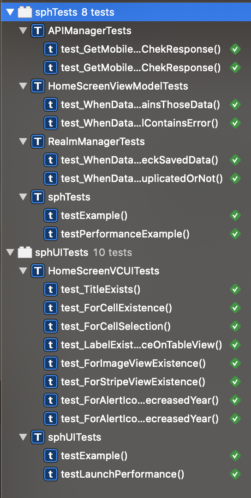

# SPH_IOS

This application developed using Swift (For iOS) and consumes Api from Data.gov.sg to retrieve a list of mobile data usage which summarize the amount the of data sent over Singapore’s mobile networks from 2008 to 2018.

## Completed Tasks:
 - Task ONE: Display a list of data
 - Task TWO: Display a clickable image
 - Task THREE: Data Caching (Using Relm DB)

- Non-emulator Test: Completed
- Emulator test: Completed

## Screenshots
Home Screen                |  Yearly Breakdown         | Working with Offline                
:-------------------------:|:-------------------------:|:-------------------------:
  |   |  

## Unit Testing & UI Testing: Passed

## App Architecure

## Technologies:
- App Architecure: MVVM
- Network: [Alamofire](https://github.com/Alamofire/Alamofire)
- Offline Caching: [Realm DB](https://realm.io/)
- Unit Test For Mock: [Mocker](https://github.com/WeTransfer/Mocker)
- Animation: [Lottie](https://airbnb.design/lottie/)
